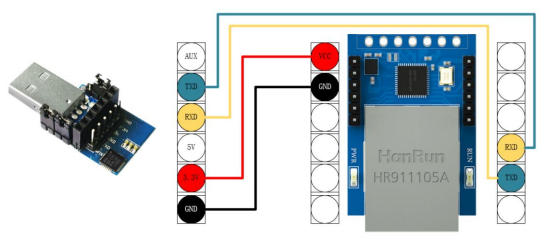

# EbyteNT1AT
API for Ebyte NT1 module and the use for AT commands

## Use

Initialize the serial port

    Serial2.begin(115200, SERIAL_8N1, RX_PIN, TX_PIN);

and use in the Begin.

    Nt1.Begin(Serial2);

then you simple use the api:

    Nt1.GoIntoAT();

    Nt1.SendAT("AT+MAC");

    etc.

